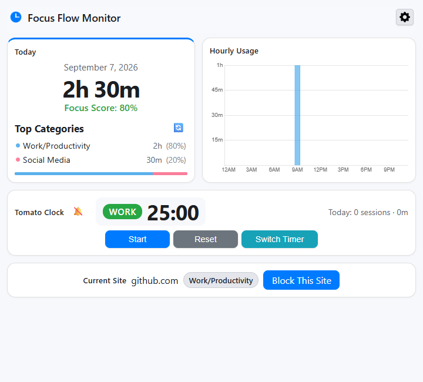
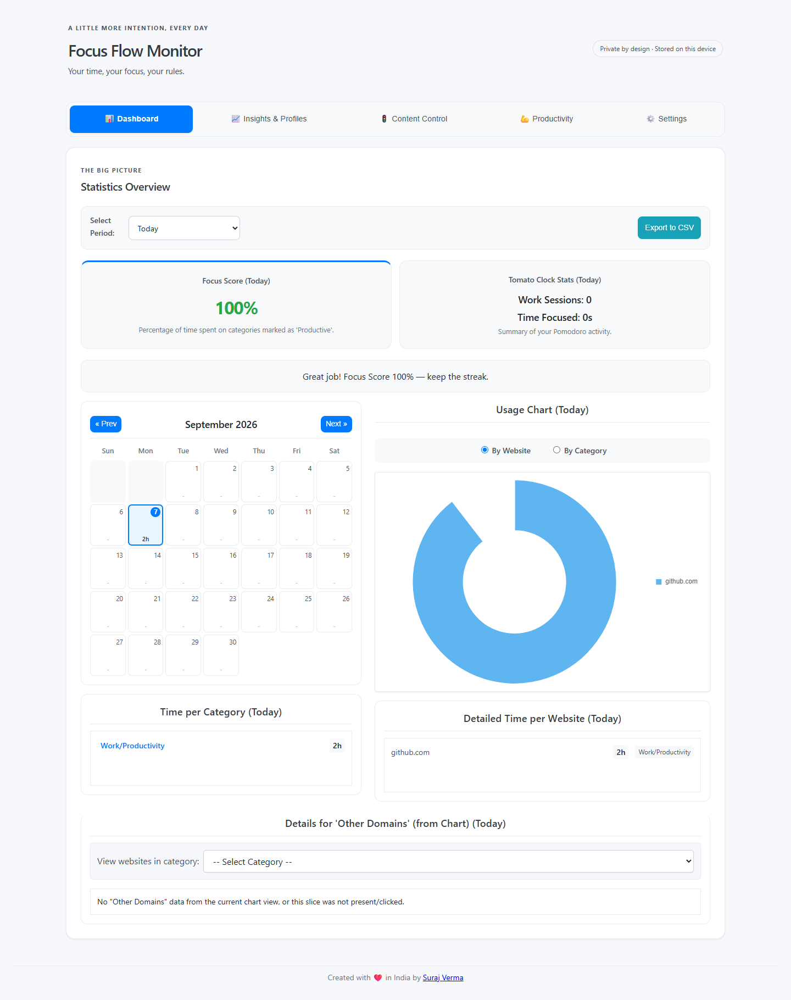
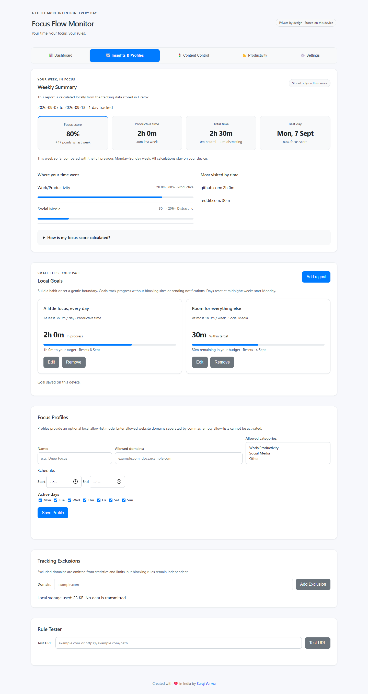
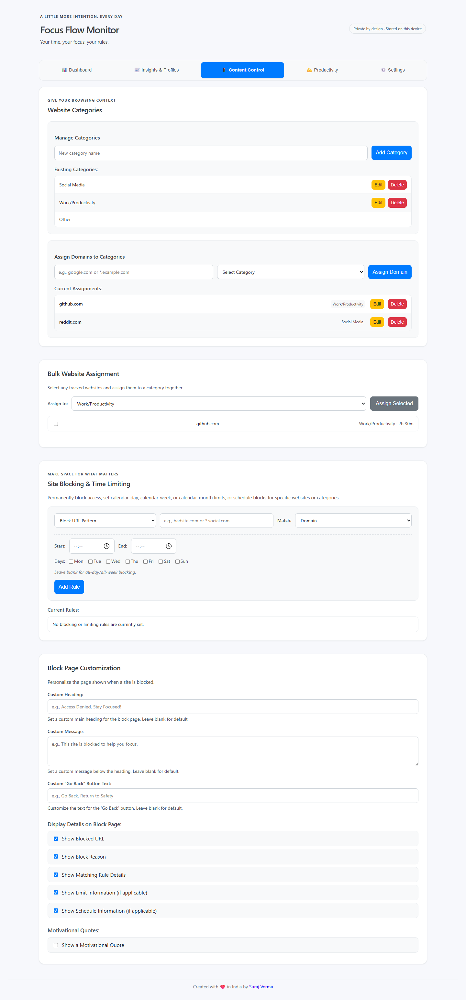
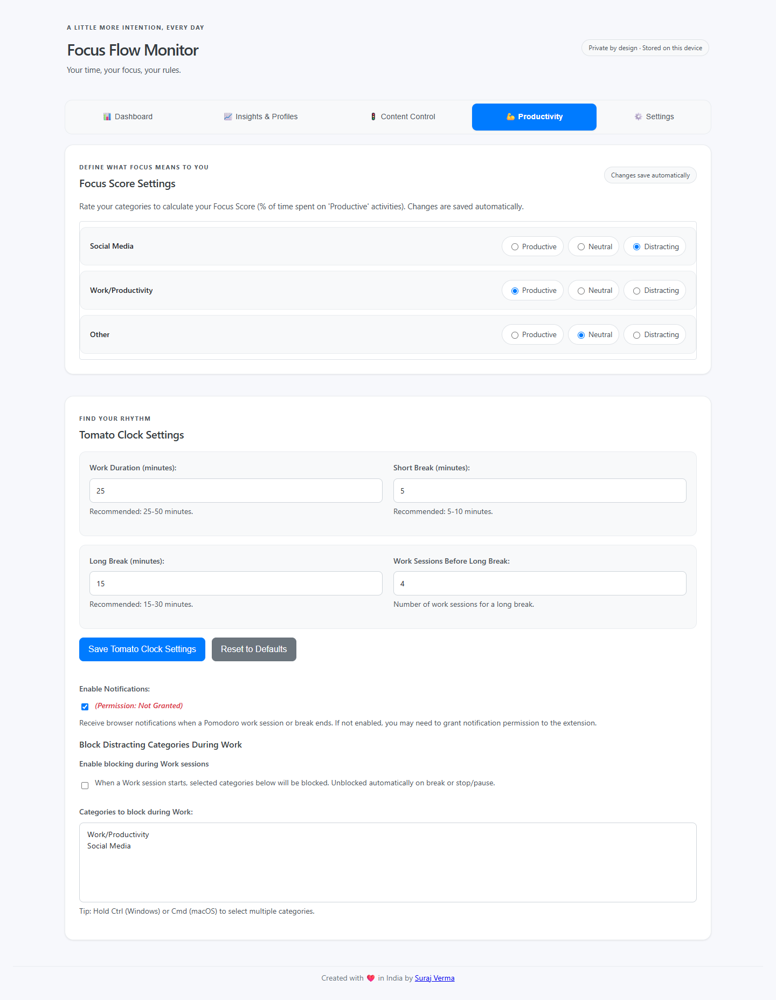
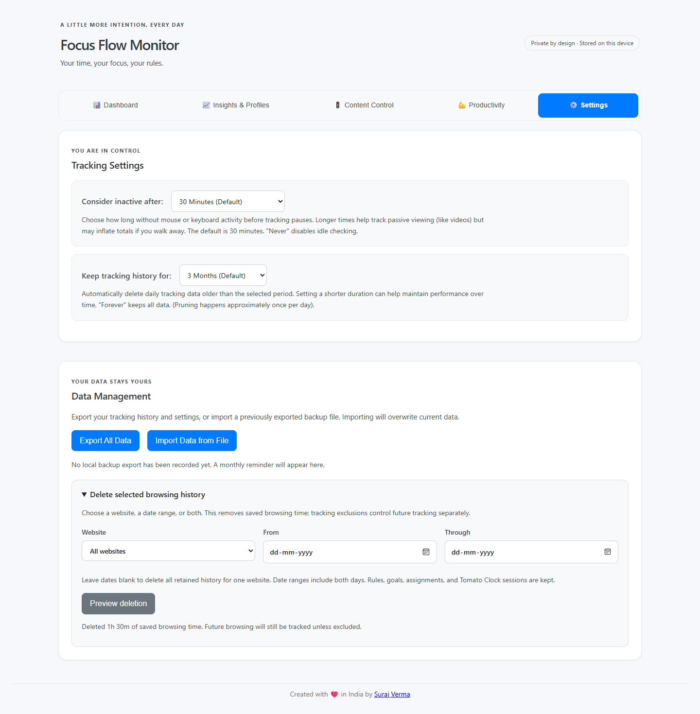

# Focus Flow Monitor

Understand your browsing time, control distractions, and build better focus habits with a privacy-focused Firefox extension.

[Firefox Add-ons](https://addons.mozilla.org/en-US/firefox/addon/focusflow-monitor/) · [Beta releases](https://github.com/SurajVerma/focus-flow-monitor/releases) · [Report an issue](https://github.com/SurajVerma/focus-flow-monitor/issues) · [MPL 2.0 license](LICENSE)

Your tracking history and settings stay in your browser. No account, cloud sync, or analytics service is required.



This README describes the current source and beta feature set. The Firefox Add-ons release may not include every feature yet. See the [release notes](https://github.com/SurajVerma/focus-flow-monitor/releases) for changes included in each published version.

## Explore your activity

- **Dashboard:** View website and category totals, charts, a focus score, and a calendar for exploring individual days.
- **Insights & Profiles:** Compare this week with the previous week, see productive time and category contributions, track local goals, and manage focus profiles.
- **Content Control:** Manage categories, assign multiple websites at once, and create blocking rules or time limits.
- **Productivity:** Set category productivity ratings, configure the Tomato Clock, and customize the blocked page.
- **Settings:** Configure inactivity and retention, export or restore backups, and selectively delete tracking history.

The toolbar popup keeps today's summary, hourly activity, Tomato Clock, and current-site actions close at hand. Light and dark themes follow your system preference.

## Focus tools

### Rules and time limits

Block a domain, an exact URL, or a URL prefix. Add exceptions to a rule to allow particular pages within a broader block. Rules can run on selected days and times.

Set calendar-day, calendar-week, or calendar-month time limits for websites and categories. Weeks start on Monday; these are calendar periods rather than rolling windows. A scheduled block and a separate time-limit rule can be used together.

### Focus profiles

Create an allow-list of websites and categories for a particular activity. Activate the profile manually; its selected days and times control when it applies. Stop it from Insights & Profiles when finished. Firefox internal pages and extension pages remain accessible.

### Goals and insights

Set daily or weekly goals for productive time, a category, or an exact website domain, with either a minimum target or a maximum budget. Progress is calculated from retained history and starts a new period with the calendar. Goals do not block websites or send notifications, and they are included in backups.

The focus score is the percentage of tracked time in categories rated **Productive**. Neutral and Distracting time both count toward total time. Adjust your category ratings in Productivity to reflect how you use the web.

### Tomato Clock

Start, pause, reset, or switch between work and break timers from the popup. View session statistics and configure durations in Productivity. Timer notifications are optional and require permission only when enabled.

## Privacy and data control

Browsing-time records, website assignments, rules, profiles, goals, and settings are stored locally in Firefox. The extension does not upload them or use remote analytics. Firefox may contact Mozilla or GitHub for extension updates; this is separate from tracking-data storage.

You can exclude websites from tracking, configure retention, and export or import a backup. Exported files contain your data, so keep them somewhere you trust. Beta and public installations use separate local storage; there is no automatic synchronization between them.

In **Settings → Data Management**, preview and delete history for a website, an inclusive date range, or both. Rules, category assignments, goals, and Tomato Clock sessions are preserved. Reports, goal progress, and time-limit usage reflect the remaining history.

### Why these permissions?

| Permission                      | Purpose                                                              |
| ------------------------------- | -------------------------------------------------------------------- |
| Tabs and access to website URLs | Identify the active website and apply tracking and blocking rules.   |
| Web requests and blocking       | Intercept matching navigation and show the extension's blocked page. |
| Storage                         | Save history and settings on your device.                            |
| Idle                            | Pause tracking after the configured period of inactivity.            |
| Alarms                          | Schedule background checks and timer work.                           |
| Notifications, optional         | Display Tomato Clock notifications when enabled.                     |

### Known limitations

- URL-path rules depend on navigation events. Sites that change pages without a full navigation may require a reload or normal navigation for a rule to take effect.
- URL and URL-prefix matching apply to blocking. Time limits operate at website-domain or category level.
- Custom redirect destinations and yearly limits are not supported.
- Legacy hourly charts combine time across websites. Deleting one website's history also clears hourly charts for affected days, while preserving other websites' daily totals. The deletion preview explains this before you confirm.
- Deleting history reduces usage counted toward time limits and goals. These tools support your own focus habits; they are not intended as tamper-proof access controls.

## Install

For the public release, use [Firefox Add-ons](https://addons.mozilla.org/en-US/firefox/addon/focusflow-monitor/). For beta testing, download the signed `.xpi` attached to a [GitHub release](https://github.com/SurajVerma/focus-flow-monitor/releases) and open it in Firefox. Pin the extension to the toolbar, then use its gear button to open the options page.

Beta and public builds have different extension IDs and can coexist. To move between them, export your data from the existing installation and import it into the destination installation through Settings → Data Management. Keep the original backup until you have checked the imported data.

## Screenshots

These screenshots use sample activity rather than personal browsing history.

### Dashboard



### Insights & Profiles



### Content Control



### Productivity



### Settings



## Develop and contribute

Bug reports and focused pull requests are welcome. Include the extension version, Firefox version, steps to reproduce, and expected behavior. Remove personal browsing data from screenshots and attachments before sharing them.

Install Node.js and npm compatible with the dependencies in `package.json`, then:

```bash
git clone https://github.com/SurajVerma/focus-flow-monitor.git
cd focus-flow-monitor
npm install
npm test
npm run build:beta
```

In Firefox, open `about:debugging#/runtime/this-firefox`, choose **Load Temporary Add-on**, and select `dist/beta/manifest.json`. Reload the temporary extension after rebuilding. Temporary installations are for development, not a replacement for signed release packages.

| Command                                 | Purpose                                                                 |
| --------------------------------------- | ----------------------------------------------------------------------- |
| `npm test`                              | Run automated tests.                                                    |
| `npm run test:watch`                    | Run tests while editing.                                                |
| `npm run validate`                      | Check manifests and required assets.                                    |
| `npm run lint`                          | Check JavaScript lint rules.                                            |
| `npm run format:check`                  | Check repository formatting.                                            |
| `npm run check`                         | Run validation, lint, formatting, and tests in sequence.                |
| `npm run build:dev`                     | Create a development build; the current four-part version selects beta. |
| `npm run build` or `npm run build:beta` | Create a production beta build in `dist/beta`.                          |
| `npm run build:release`                 | Create a production public build in `dist/release`.                     |

Production build scripts clean `dist` first, so building one target removes previous build output. They synchronize manifest versions from `package.json`; they do not publish, sign, or upload a release.

Shared logic lives in `src/core/`, Firefox background scripts in `background/`, and page code in `options/`, `popup/`, and `blocked/`. The extension uses Firefox Manifest V2. Automated tests cover core behavior and selected integration paths; verify changes in live Firefox as well, especially upgrades, navigation blocking, and data restoration.

## License

[Mozilla Public License 2.0](LICENSE).

If you find Focus Flow Monitor useful, you can [buy me a coffee ☕](https://ko-fi.com/skv).
